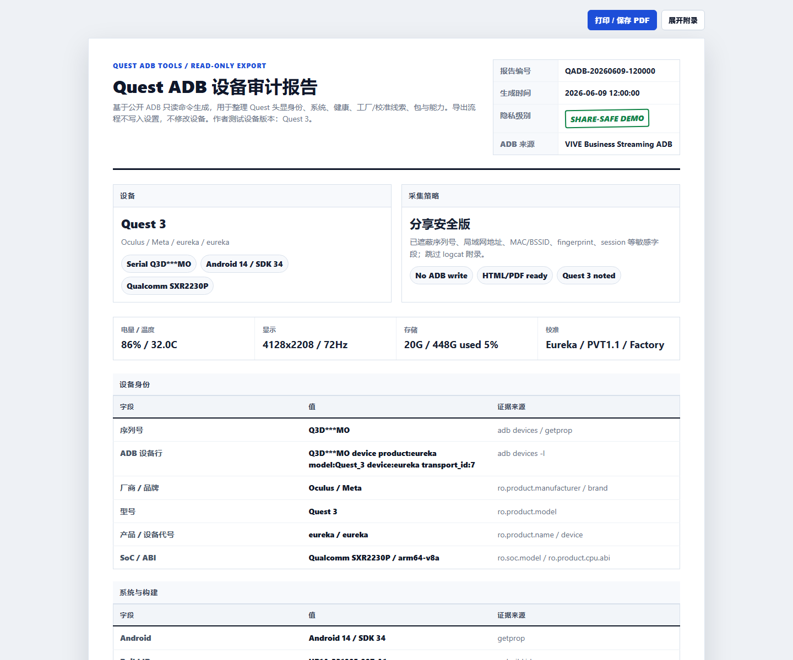

# Quest ADB Dashboard

Single-file Windows BAT tool with a local WebUI for Meta Quest ADB status, troubleshooting, and share-safe HTML device audit reports.

Author test device: **Meta Quest 3** (`eureka`). Most read-only Android/ADB inventory features should work on other Quest headsets after USB debugging is authorized, but the documented observations are Quest 3 focused.



## What It Does

- Finds `adb.exe` from common Windows locations, including Android platform-tools and VIVE Hub installs under `C:\Program Files` or `D:\Software`.
- Runs as one end-user file: `dist/Quest_ADB_Tools.bat`.
- Starts a local WebUI bound to `127.0.0.1`.
- Shows connection, battery, power, Wi-Fi, storage, memory, display, thermal, controller hints, build metadata, and factory/calibration clues.
- Provides an optional read-only MCP server for CI/agent inventory workflows.
- Exports two standalone HTML reports:
  - `share-safe`: redacted report intended for support posts, GitHub issues, and screenshots.
  - `private-full`: complete local report for personal troubleshooting only.
- Adds explicit inference notes for factory/calibration metadata so internal station codes are not overclaimed as country, city, or factory names.

## Safety Model

The **HTML export path is read-only**. It uses public ADB reads such as:

- `getprop`
- `settings list`
- `dumpsys battery`
- `dumpsys power`
- `dumpsys display`
- `dumpsys sensorservice`
- `dumpsys thermalservice`
- `pm list packages`
- `pm list features`

The broader WebUI and BAT menu also contain interactive convenience actions for sleep, wake, keep-awake, wireless ADB, restore, and custom settings. Those actions are separate from export and can change headset state. Use them only when you understand the effect.

The optional MCP server is stricter than the WebUI. It exposes only read-only
ADB inventory tools and has no generic shell, install, uninstall, push, pull,
reboot, wireless ADB, settings write, input, or broadcast tool. See
[Safe MCP and CI](docs/SAFE_MCP_CI.md).

## Quick Start

1. Enable Developer Mode for the Quest headset.
2. Connect the headset by USB and approve the USB debugging prompt inside the headset.
3. Run:

```bat
dist\Quest_ADB_Tools.bat
```

4. Press `W` to open the local WebUI.
5. Use **一键导出设备全部信息** to create both HTML reports.
6. Share only the `share-safe` report after manual review.

## Public Sharing Checklist

Do not upload private evidence unless you have reviewed it manually. Public posts should avoid:

- Real Quest serial numbers.
- Private Wi-Fi SSIDs, BSSIDs, MAC addresses, or LAN IPs.
- Real `logcat` dumps.
- Full bugreports.
- Account, token, login, app-private, or local machine data.

Example reports in `examples/` use synthetic Quest 3-like data. The private example is still synthetic and exists only to show the report layout.

## Knowledge Base

- [ADB and Quest notes](docs/ADB_QUEST_NOTES.md)
- [Methods and inference limits](docs/METHODS.md)
- [HTML export reports](docs/EXPORT_REPORTS.md)
- [Public sharing guide](docs/PUBLIC_SHARING.md)
- [Development and rebuild workflow](docs/DEVELOPMENT.md)
- [Self-review checklist](docs/SELF_REVIEW.md)
- [Release notes](docs/RELEASE_NOTES.md)

## Project Layout

```text
dist/
  Quest_ADB_Tools.bat        End-user single-file tool.
src/
  QuestAdbWebUi.cs           Local 127.0.0.1 WebUI server and report generator.
  QuestAdbWebUi.html         Embedded WebUI frontend.
scripts/
  build-webui.ps1            Rebuilds WebUI EXE and embeds it into the BAT.
  generate-sample-reports.ps1
docs/
  *.md                       Public Quest/ADB knowledge base and workflow docs.
mcp/
  quest_adb_safe_mcp.py      Read-only MCP server for CI/agent workflows.
examples/
  sample_quest3_share_safe.html
  sample_quest3_share_safe.png
  sample_quest3_private_full.html
  sample_quest3_private_full.png
```

## Notes

This project is not affiliated with Meta, Oculus, Qualcomm, VIVE, or Virtual Desktop. It is a local Windows utility for authorized devices you control.

## License

MIT. See `LICENSE`.
